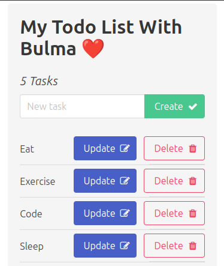

# Todo List Application

This repository contains a web application for managing daily tasks with a structured CRUD-based system. The front-end is built using **HTML, CSS (Bulma), and JavaScript**, while the back-end is powered by **Node.js (Express) and MySQL**.

## Table of Contents
- [Todo List Application](#todo-list-application)
  - [Table of Contents](#table-of-contents)
  - [Introduction](#introduction)
  - [Features](#features)
  - [Pages](#pages)
  - [Technologies Used](#technologies-used)
  - [Installation](#installation)
  - [Usage](#usage)
  - [Screenshot](#screenshot)
  - [Contact](#contact)
  - [Credits](#credits)

## Introduction
The **Todo List Application** allows users to efficiently manage their daily tasks using a structured CRUD system. Users can **add, read, update, and delete tasks**. The application provides a **simple and responsive interface** for a seamless task management experience.

## Features
- **Task Management**: Users can create, update, delete, and view tasks.
- **Responsive Design**: Optimized for both desktop and mobile devices.
- **Persistent Data**: All tasks are stored in a **MySQL database** to ensure persistence.
- **Interactive UI**: Uses JavaScript to dynamically update the task list in real-time.
- **User-Friendly Interface**: Simple and intuitive design for effective task management.

## Pages
1. **Homepage**: Displays the task list with options to add, update, and delete tasks.
2. **Task Actions**: Allows users to interact with their tasks via buttons for CRUD operations.

## Technologies Used
- **Frontend:** HTML, CSS (Bulma), JavaScript
- **Backend:** Node.js, Express.js
- **Database Management:** MySQL (`database.sql` for schema setup)
- **Client-Side Enhancements:** JavaScript for dynamic interactions

## Installation
1. Clone this repository to your local machine.
2. Make sure **Node.js** and **npm** are installed.
3. Run `npm install` to install all dependencies.
4. Set up a **MySQL database** using the provided `database.sql` script.
5. Modify the **db.js** file to update **database credentials** (**ensure username and password are changed for security reasons**).
6. Start the application with `npm start`
7. Open your browser and access the application at `http://localhost:3000`.

## Usage
Once the application is running, users can:
- Add new tasks to the list.
- View all pending tasks.
- Update existing tasks.
- Delete tasks that are no longer needed.

## Screenshot

## Contact
For inquiries regarding this project, please reach out via email:  
📩 contact@xiaodev.fr

## Credits
The Todo List Application was created and maintained by **XiaoDev**.

---
If you have any questions or feedback, please [reach out](mailto:&#99;o&#110;&#116;%61%63t&#64;&#120;&#105;a&#111;&#100;%65%76%2e&#102;%72).